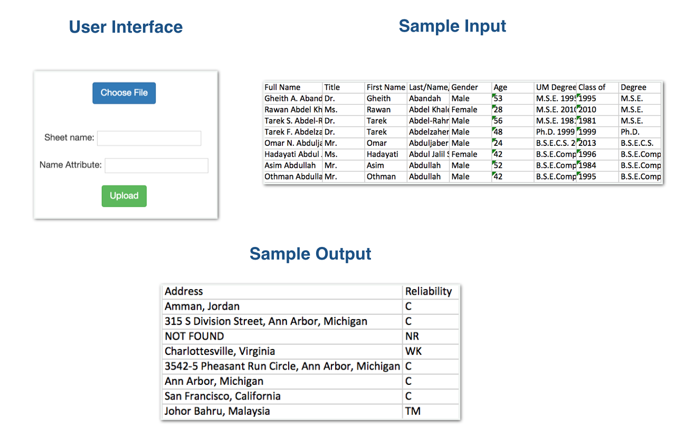

# AlumnUS

####Introduction

AlumnUS consists of a simple UI and a REST API which can be used to find Alumni that U of M has lost touch with. The expected input is an Excel file, and in response, the app will send a new Excel file with the addresses of the candidates that are shown. The back-end REST API for AlumnUS is built with Node.js, while the front-end uses HTML, and a simple HTTP POST request to pass the excel spreadsheet to the back-end.

The AlumnUS API will call another people-search API, developed by Pipl, which returns details of individuals who could be a match for the parameters the AlumnUS API passes to it. It will store information from its call to the people-search API into a MySQL datastore, which can later be queried to find information about historical searches the AlumnUS API has performed.

Images of the input, output, and the general UI can be seen below.

####Functionality

The AlumnUS API uses an internal ranking system to judge the accuracy of the results that the pipl API returns for a given person. This ranking system takes into account the fact that the person is a UM alumni, as well as the person-specific information that is known from the university's internal data. This ranking system can be seen in <a href= './models/piplmodel.js'> piplmodel.js </a>, and this can be adjusted if any other developer chooses to clone this repo and adapt it to their own needs. 

Internally, the AlumnUS API makes one call to the Pipl API to find how many results the API returns. If this number is greater than 49 (max number of results Pipl can return), the AlumnUS API assumes that it does not have a proper set of results from which to choose the right person. At this point, it will make a more detailed query, including the gender and age of the individual, and filter from this point. Again, if the number of results for this Pipl API request is greater than 49, the AlumnUS API will make a more detailed request using the "person" object that Pipl allows. The reason for this is to ensure that the least number of results slip past the AlumnUS API, and instead gives the AlumnUS API the largest possible, good data set from which it can use its more-specific filtration system.

####Usage

There is a basic UI, which was pictured in the introduction, from which a user can upload a file, while also specifying which sheet they want to use. The front-end also requests some information about what the names of each field is. This currently only requests the title of the "name" field, though it will be expanded for other use-cases in the future.

A file is then downloaded to the user, along with two columns appended. These include an "address" field, and a "reliability" field. The "address" field stores the address of the individual that the AlumnUS API matches up to the individual on the given row. The "reliability" field stores a code that pertains how accurate the result is presumed to be. This is generated based on the ranking for that individual whose "address" is included. It essentially accounts for the situations where there are too many individuals to find an ideal result, when there is no result found, or when the result is simply weak and doesn't fulfill some of the parameters passed by the user. This allows for filtration when looking at the Excel sheet that is output to the user.

######Response codes:
* **"SR"** - Output when the result is considered very strong; many of the conditions were satisfied
* **"MD"** - Output when the result is moderately strong; around half of the conditions were satisfied
* **"WK"** - Output when the result is weak; doesn't pass many of the conditions given by the user
* **"TM"** - Output when there are too many results to differentiate properly between them
* **"NR"** - Output when there are no results from the Pipl API for the given person

####Tools used

There are a few different tools the app makes use of:

* Node.js & NPM
* Express.js
* HTML5/Bootstrap CSS
* <a href="https://pipl.com/dev/">Pipl API to search user information</a>
* <a href="https://www.npmjs.com/package/pipl">Pipl Node Wrapper</a>
* <a href="https://www.npmjs.com/package/request">Request library to call Pipl API with detailed "person" object </a>
* <a href="https://github.com/expressjs/multer">Multer for file uploads (Excel sheet)</a>
* <a href="https://www.npmjs.com/package/xls-to-json">xls-to-json</a>
* <a href="https://github.com/rikkertkoppes/json2xls">json2xls</a>

